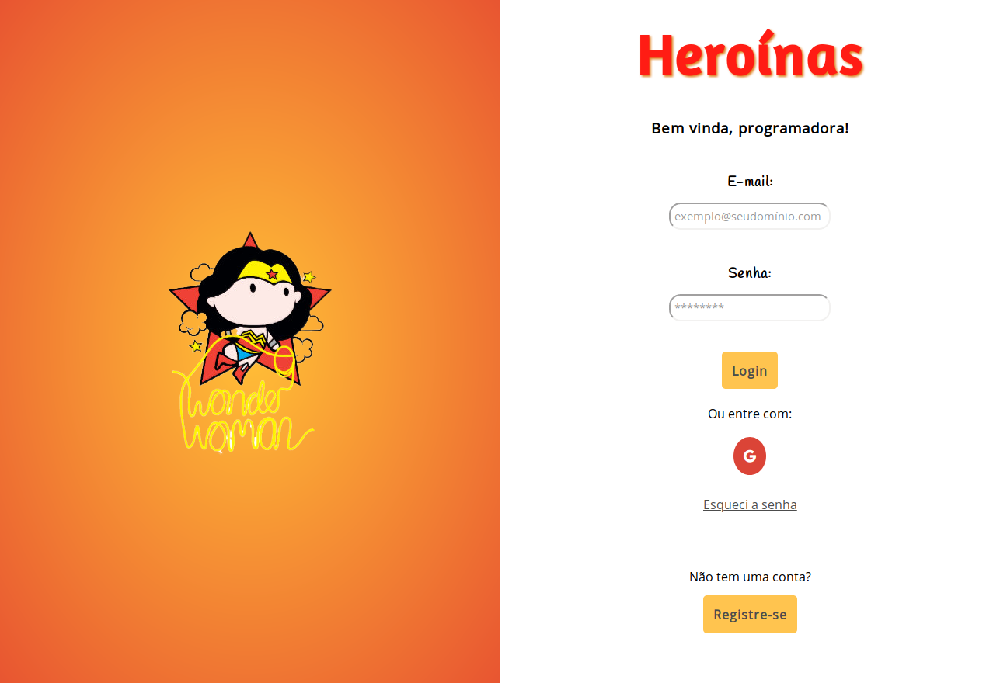
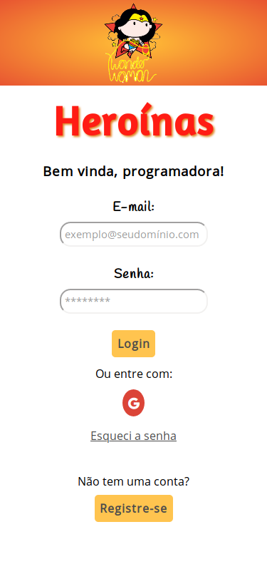
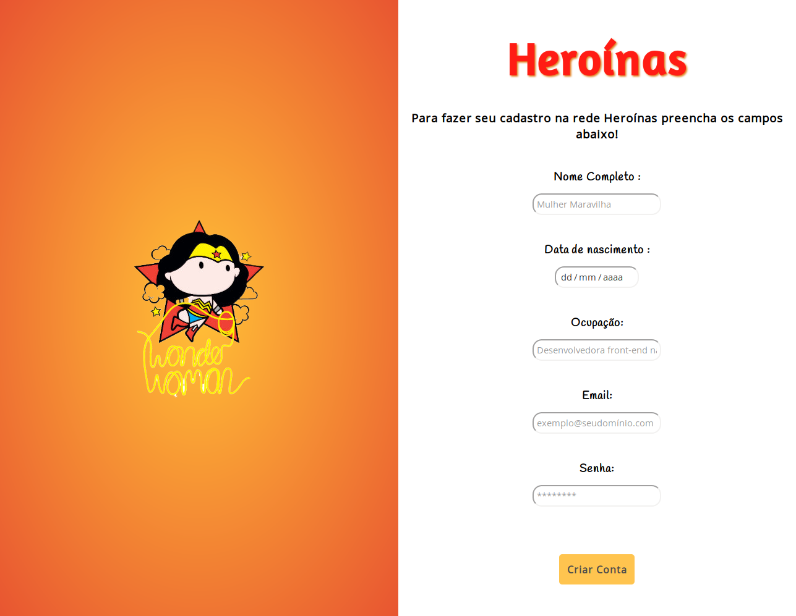
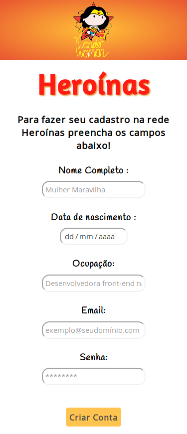
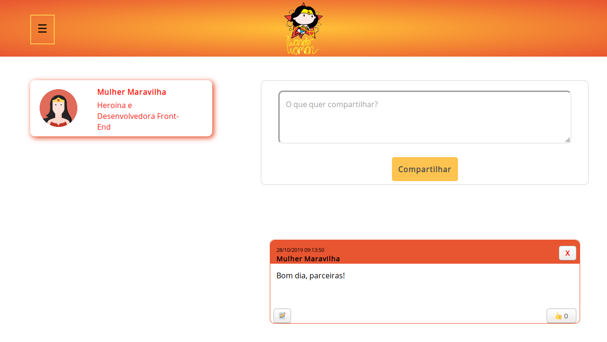
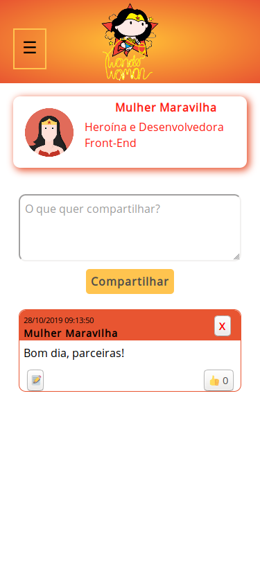
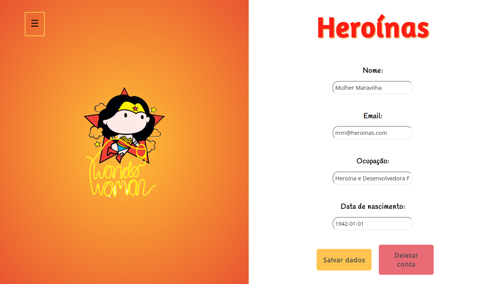
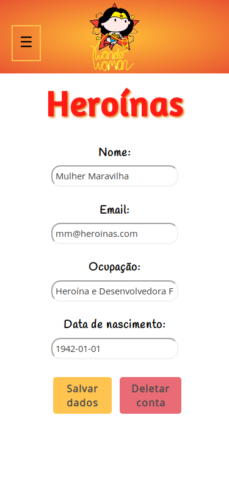

# Rede Social Heroínas

## Índice
- [Rede Social Heroínas](#rede-social-heroínas)
  - [Índice](#Índice)
  - [1. Resumo do Projeto.](#1-resumo-do-projeto)
  - [2. Características-Técnicas.](#2-características-técnicas)
  - [3. Histórias de Usuários Implementadas](#3-histórias-de-usuário-implementadas)
  - [4. Tempo do Projeto](#4-tempo-do-projeto)
  - [5. Template das Telas](#5-template-das-telas)

## 1. Resumo do Projeto

Neste projeto, criamos a Rede Social **Heroínas**, que é voltada para programadoras que desejem se conectar com outras programadoras. O tema escolhido foi "Feminismo". 

A nossa personagem principal é a Mulher Maravilha - que, agora, decidiu se desafiar e começar uma nova profissão - assim como nós, alunas da Laboratória! 

## 2. Características Técnicas

As **caraterísticas técnicas** da aplicação envolveram:
- Uma *Single-Page Application*;
- CSS: Desenho com enfoque no mobile first;
- Permite a persistência, edição, atualização e exclusão de dados;

### Desenvolvimento FrontEnd

#### Tecnologias 

##### HTML5 
* HTML5 semântico.

##### CSS3
* Implementação de seletores de classe.
* Utilizamos `flexbox` para alcançar o desenho `mobile first`, implementando um layout que se adapte a **mobile e desktop**,conforme modelo proposto.
* Não utilizamos frameworks de CSS (bootstrap), nem estilização com `float`.

##### JavaScript (ES6+)

* Utilizamos módulos do JavaScript ES6 na elaboração do código.
* Uso de Template strings.
* Implementamos um sistema de rotas (sem uso de bibliotecas externas) para trocar de uma tela para outra de maneira dinâmica (SPA).

### Persistência de dados

Neste projeto, utilizamos o `Firestore` do `Firebase` para estruturação dos dados, para que estes possam ser consultados, atualizados, modificados e eliminados segundo os requerimentos do usuário.

#### Ferramentas utilizadas
1. HTML 5
2. CSS
3. *Vanilla* JS
4. Git e GitHub
5. Visual Code Studio
6. Firebase *auth*, *firestore* e *hosting*

## 3. Histórias de Usuário Implementadas
 
* Como usuário novo, devo poder criar uma conta com email e senha válidos para poder iniciar uma sessão e ingressar na Rede Social.

* Como usuário novo, devo poder ter a opção de iniciar sessão com minha conta do Google ou Facebook para ingressar na Rede Social sem necessidade de criar uma conta de email válido.

* Como usuário logado devo poder criar, guardar, modificar no mesmo lugar (in place) e deletar publicações (post).

* Como usuário logado devo poder ver todos os posts que criei até o momento, do mais recente para o mais antigo.

* Eu como usuário logado, posso dar like e ver a contagem de likes em minhas publicações

* Eu como usuário logado, posso escrever, salvar, editar ou deletar um comentário em minhas publicações.

* Ao final devo poder ingressar na Rede Social e poder visualizar os dados de meu perfil criado e editá-los.

## 4. Tempo do Projeto
 
O projeto foi elaborado em 3 (três) semanas.

## 5. Template das Telas
 
**Tela do Login:**

**Tela de Registro:**

**Tela do Feed:**

**Tela do Perfil:**

